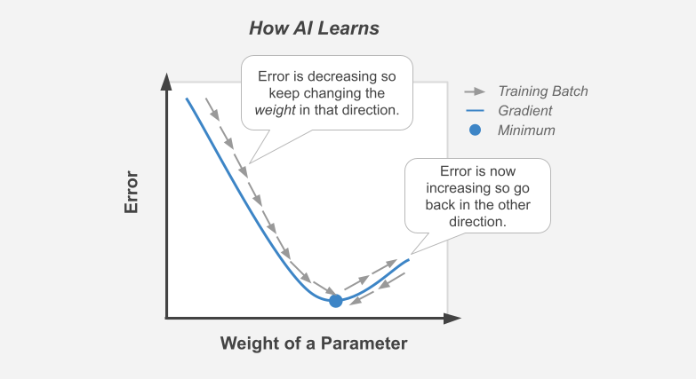

############
How AI Works
############

*Boiling artificial intelligence down to its fundamental concepts.*

----

|

.. image:: images/gears.png
  :width: 50%
  :align: center
  :alt: gears
  :class: no-scaled-link

|

.. raw:: html

  

    If you are generally familiar with spreadsheets then you are already half way to understanding AI. For the purpose of this discussion, let's assume that each <i>row</i> in a spreadsheet represents a record, and each <i>column</i> provides information about that record. Bearing this in mind, there are two major types of AI:
  

.. list-table::
  :widths: 15, 85
  :align: center

  * - **Generative**
    - Given what we know about rows 1:1000 → generate row 1001.

  * - **Discriminative**
    - Given what we know about columns A:F → determine the values of column G.

|

----

|

.. raw:: html

  

    <i>Discriminative</i> analysis is highly practical because it can help us answer two important questions:
  

.. list-table::
  :widths: 15, 85
  :align: center
  
  * - **Categorize**
    - What is it - benign vs malignant? landmine vs rock? approve vs deny? fake vs real?

  * - **Quantify**
    - How much - price? distance? volume? age? radioactivity? gene expression?

|

.. image:: images/categorize_quantify.png
  :width: 85%
  :align: center
  :alt: categorize_quantify
  :class: no-scaled-link

|

----

|

.. raw:: html

  

    As an example, let's pretend we work at a zoo where we have a spreadsheet that contains information about the traits of different animals 🐢 We want to use <i>discriminative learning</i> in order to <i>categorize</i> the species of a given animal.
  

.. list-table::
  :widths: 20, 80
  :align: center
  
  * - **Features**
    - Informative columns like `num_legs`, `has_wings`, `has_shell`.

  * - **Label**
    - The `species` column that we want to predict.

|

.. image:: images/turtle_ruler.png
  :width: 45%
  :align: center
  :alt: turtle_ruler
  :class: no-scaled-link

|

.. raw:: html

  

    We learn about the <i>features</i> in order to predict the <i>label</i>.
  

|

----

|

.. raw:: html

  

    To automate this process 🔌 we need an equation (aka <i>algorithm</i> or <i>model</i>) that predicts our <i>label</i> when we show it a set of <i>features</i>. Here is our simplified example:
  

  
|

.. code-block:: python

  species = (num_legs * x) + (has_wings * y) + (has_shell * z)

|

.. raw:: html

  

    The challenging part is that we need to figure out the right values (aka <i>weights</i>) for the <i>parameters</i> (x, y, z) so that our algorithm makes accurate predictions ⚖️ To do this by hand, we would simply use trial-and-error; make a change to the value of <i>x</i>, and then determine if that change either improved the model or made it worse.
  

|

----

|

.. raw:: html

  

    Fortunately, computers can rapidly perform these repetetitive calculations on our behalf. This is where the magic of AI comes into play 🔮 It simply automates that trial-and-error.
  

|

.. raw:: html

   
  

    The figure above demonstrates what happens during a training <i>batch</i>: (1) the algorithm looks at a few rows, (2) makes predictions about those rows using its existing weights, (3) checks how accurate those predictions are, (4) adjusts its weights in an attempt to minimize future errors. It's like finding the bottom of a valley by rolling a ball down it.
  

|

|

.. raw:: html

  

    With repetition, the model molds to the features like a memory foam mattress.
  

  
|
  
----

|

.. raw:: html

  

    There are different types of algorithms for working with different types of data:
  

.. list-table::
  :widths: 20, 40
  :align: center
  
  * - **Linear**
    - Tabular data like spreadsheets.

  * - **Convolutional**
    - Images and video 📸.

  * - **Recurrent**
    - Time series data ⏱️.

.. raw:: html

  

    They can be mixed and matched to handle almost any real-life scenario.
  

|

----

|

.. raw:: html

  

    A data scientist oversees the training of an algorithm much like a chef cooks a meal 🎛️ The heat is what actually cooks the food, but there are still a few things that the chef controls: 

.. list-table::
  :widths: 20, 80
  :align: center
  
  * - **Architecture**
    - If the food doesn't fit in the pan, switch to a larger pan with deeper/ taller *layers*.

  * - **Hyperparameters**
    - If it's cooking too fast, then turn down knobs like the *learning rate*.

|

.. image:: images/cooking.png
  :width: 55%
  :align: center
  :alt: cooking
  :class: no-scaled-link

|

.. raw:: html

  

    At first, the number of <i>tuning</i> options seems overwhelming, but you quickly realize that you only need to learn a handful of common dinner <a href='tutorials.html'>recipes</a> in order to get by.
  

|

----

|

.. raw:: html

  

    And that's really all there is to it 🏄‍♂️ The rest is just figuring out how to feed your data into and out of the algorithms, which is where <a href='index.html'>AIQC</a> comes into play.
  

|

.. image:: images/oz.png
  :width: 35%
  :align: center
  :alt: oz
  :class: no-scaled-link
  
|