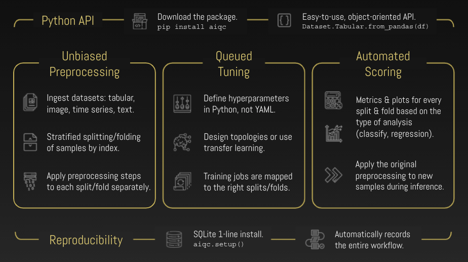
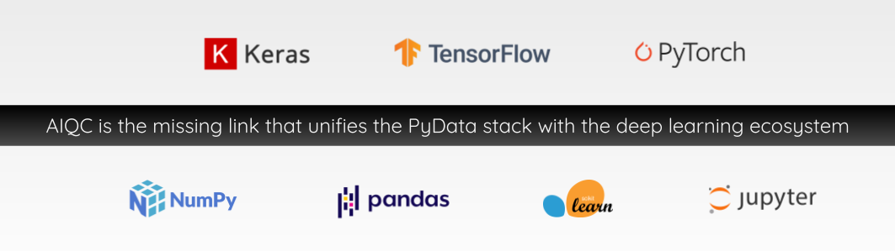

.. toctree::
  :maxdepth: 2
  :caption: Getting Started
  :hidden:

  notebooks/installation
  notebooks/example_datasets

.. toctree::
  :maxdepth: 2
  :caption: Workflows
  :hidden:

  notebooks/keras_binary_classification
  notebooks/keras_multi-label_classification
  notebooks/keras_regression
  notebooks/image_classification
  notebooks/sequence_classification
  notebooks/keras_tabular_forecasting
  notebooks/pytorch_binary_classification
  notebooks/pytorch_multi-label_classification
  notebooks/pytorch_regression
  notebooks/tensorflow_binary_classification
  notebooks/heterogeneous_features

.. toctree::
  :maxdepth: 2
  :caption: Documentation
  :hidden:

  notebooks/visualization
  notebooks/api_high_level
  notebooks/api_low_level
  notebooks/inference

.. toctree::
  :maxdepth: 2
  :caption: About
  :hidden:

  mission
  community
  links

..
  Without this comment, `make html` throws warning about page beginning improperly.

.. 
   nick wrote this when we were talking about how to get his custom google form
   to show in the documentation to prevent seeing docs without providing your email.
   he said you could track whether or not they provided it with a cookie.
   https://github.com/js-cookie/js-cookie

   raw:: html

   

   

.. raw:: html
  
   
  

    <b>→ AIQC is a Python framework for rapid, rigorous, & reproducible deep learning.</b>
      
    <i style="color: #505050;">On a mission to accelerate open science by making best practice deep learning more accessible.</i>
  

   
   

.. raw:: html
  
    
  <ul style="text-align: center; list-style-position: inside;">
    <li class="extra-bullets">Achieve end-to-end reproducibility by recording both data preparation & training experiments.</li>
    <li class="extra-bullets">Easily orchestrate parameterized protocols for data preprocessing & model evalaution.</li>
  </ul>
   

|

----

.. raw:: html
  
   
  

    <b>→ Write 95% less code by integrating these best practice workflows into your research:</b>
  

    

.. raw:: html
  
  <!-- intentionally 2 space indentation -->

  <table class="compatibility" valign="center">
  <tr>
    <td id="top-left"></td>
    <td class="tbl-head  top-left">Tabular <small>(array, df, file)</small></td>
    <td class="tbl-head">Sequence <small>(3D, files, time series)</small></td>
    <td class="tbl-head  top-right">Image <small>(png, jpg)</small></td>
  </tr>
  <tr>
    <td class="tbl-head top-left">Classification <small>(binary, multi)</small></td>
    <td class="done">
      Keras (<a href='notebooks/keras_binary_classification.html'>binary</a>,
      <a href='notebooks/keras_multi-label_classification.html'>multi</a>)
       ✓ 
      PyTorch (<a href='notebooks/pytorch_binary_classification.html'>binary</a>,
      <a href='notebooks/pytorch_multi-label_classification.html'>multi</a>)
    </td>
    <td class="done">
      Keras (<a href='notebooks/sequence_classification.html'>binary</a>,
      multi</a>)
       ✓ 
      PyTorch (binary, multi)
    </td>
    <td class="done">
      Keras (<a href='notebooks/image_classification.html'>binary</a>,
      multi</a>)
       ✓ 
      PyTorch (binary, multi) 
    </td>
  </tr>
  
  <tr>
    <td class="tbl-head bottom-left">Quantification <small>(regression)</small></td>
    <td class="done">
      <a href='notebooks/keras_regression.html'>Keras</a>
       ✓ 
      <a href='notebooks/pytorch_regression.html'>PyTorch</a>
    </td>
    <td class="done">Keras ✓ PyTorch</td>
    <td class="done bottom-right">Keras ✓ PyTorch</td>
  </tr>
  
  <!--
  <tr>
    <td class="tbl-head tbl-head-Generation">Forecast </td>
    <td class="done">
      <a href='notebooks/keras_tabular_forecasting.html'>Keras</a>
       ✓ 
      PyTorch
    </td>
    <td>Coming soon.</td>
    <td class="coming-soon">Coming soon.</td>
  </tr>
  -->
  </table>

    

  <ul style="text-align: center; list-style-position: inside;">
    <li class="extra-bullets">
      <a href='notebooks/keras_tabular_forecasting.html'>
        Supports multi-variate time series forecasting & backcasting via windowing.
      </a>
    </li>
    <li class="extra-bullets">
      <a href='notebooks/tensorflow_binary_classification.html'>
        Compatible with TensorFlow 2 for model maintenance and training loop customization.
      </a>
    </li>
    <li class="extra-bullets">
      <a href='notebooks/heterogeneous_features.html'>
        Enables multi-modal analysis (e.g. combine histology images with medical records and doctor's notes).
      </a>
    </li>
  </ul>

   

----

.. raw:: html
  
   
  

    <i style="color:gray;">Thanks to the support and sponsorship of:</i>
  

    

.. image:: images/psf_wide.png
  :width: 36%
  :align: center
  :alt: framework
  :target: https://wiki.python.org/psf/ScientificWG/Charter_v3

|

----

|
|

|
|
|

----

|

########
Overview
########

I. Rapidly prepare folded data for analysis without leakage.
============================================================

.. image:: images/pipeline_25sec_compress.gif
  :width: 100%
  :alt: pipeline.gif

- Make datasets from files (csv, parquet), structures (pandas, numpy), & images (pillow).

- Designate columns by name as either Features or Labels.

- Easily split, fold, & stratify samples (`size_validation=0.12`, `fold_count=5`).

- Apply encoders by dtype (`float64`) without leaking test/ validation data.

|

II. Train many variations of an algorithm in a queue.
=====================================================

.. image:: images/hyperparam_25sec_compress.gif
  :width: 100%
  :alt: hyperparameters.gif

- Queue many training jobs for hyperparameter tuning & cross-validation.

- Automatically pass hyperparameters into training functions as `**kwargs`.

- Tweak the model topology as a param (`params['extra_conv3D_layer']=True`).

- Repeat a job to to give it a chance to perform well (`repeat_count=3`).

|

III. Evaluate algorithm performance with metrics & charts.
==========================================================

.. image:: images/plots_25sec_compress.gif
   :width: 100%
   :alt: plots.gif

- Automated performance metrics & visualizations for every split/ fold.

- Captures per-epoch history metrics for learning curves.

- Define multi-metric success criteria for early stopping.

|

IV. Effortlessly track, reproduce, & prove experiments.
=======================================================

.. code-block:: python

   ## All experiment artifacts are automatically saved.
   queue.jobs[0].hyperparamcombo.hyperparameters
   {
       'include_4th_layer': True,
       'weight_init': 'he_normal',
       'batch_size': 8,
       'dense_neurons': 64
   }

   ## A few examples:
   # Trained model.
   queue.jobs[0].predictors[0].get_model()
   # Function used to build model.
   queue.algorithm.fn_build
   # Predictions for the left-out cross-validation fold.
   queue.jobs[0].predictors[0].predictions[0].predections['fold_validation']
   # Indices of the cross-validation training fold.
   queue.jobs[0].fold.samples['folds_train_combined']['features']
   # Fitted encoders.
   queue.jobs[0].fitted_encoders['featurecoders'][0]

- Automatically records all workflow steps in a local SQLite database file.

- During inference, original preprocessing is automatically applied to new samples.

- No infrastructure hassle; `aiqc.setup()` creates the database for you.

|

V. Easy to :ref:`install </notebooks/installation.ipynb>`. With :ref:`tutorials</notebooks/keras_multi-label_classification.ipynb>` to guide you.
=================================================================================================================================================

.. code-block:: python

   # pip install --upgrade aiqc

   import aiqc
   # Data for tutorials.
   from aiqc import datum 
   # Creates & connects to the database.
   aiqc.setup() 

- :ref:`Example datasets </notebooks/example_datasets.ipynb>` built into package.

- Use any IDE (Jupyter, RStudio, VSCode, PyCharm, Spyder) & OS (Win, Mac, Lin).

- Easy to learn, 2-step tutorials: `Pipeline` that feeds into an `Experiment`.
