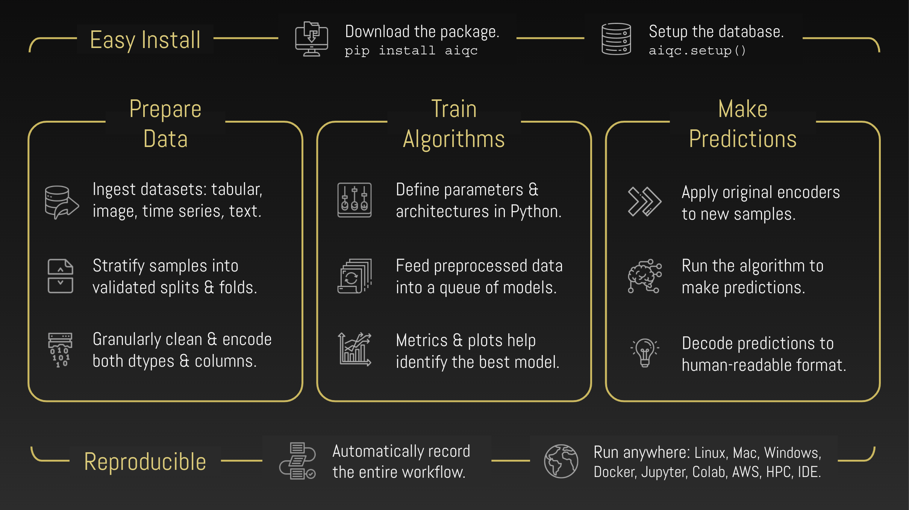

.. toctree::
  :maxdepth: 2
  :caption: Getting Started
  :hidden:

  notebooks/installation
  notebooks/example_datasets
  tutorials

.. toctree::
  :maxdepth: 2
  :caption: Documentation
  :hidden:

  notebooks/visualization
  notebooks/api_high_level
  notebooks/api_low_level
  notebooks/inference

.. toctree::
  :maxdepth: 2
  :caption: About
  :hidden:

  explainer
  mission
  community
  links

..
  Without this comment, `make html` throws warning about page beginning improperly.

.. 
   nick wrote this when we were talking about how to get his custom google form
   to show in the documentation to prevent seeing docs without providing your email.
   he said you could track whether or not they provided it with a cookie.
   https://github.com/js-cookie/js-cookie

   raw:: html

   

   

.. raw:: html
  
   
  

    <b>→ AIQC accelerates research teams with an open source framework for deep learning pipelines.</b>
     
     
    <i class="intro" style="color:gray">A simple Python framework for conducting rapid, rigorous, and reproducible experiments.</i>
     
     
     
  

.. raw:: html
  
    
  

    Deep learning is difficult to implement because leading tools skip the following <i>data wrangling</i> challenges:
  

  <ol class="intro">
    <li class="shadowBox">
      <b>Preprocessing</b> - Data must be encoded into a machine-readable format. Encoders don't handle multiple dimensions, columns, & types. Leakage occurs if splits/folds aren't encoded separately. Lack of validation splits causes evaluation bias. Which samples were used for training?
    </li>
    <li class="shadowBox">
      <b>Experiment Tracking</b> - Tuning parameters and architectures requires evaluating many training runs with metrics and charts. However, leading tools are only designed for a single run and don't keep track of performance. Validation splits and/or cross-validation folds compound these problems.
    </li>
    <li class="shadowBox">
      <b>Postprocessing</b> - If the encoder-decoder pairs weren't saved, then how should new samples be encoded and predictions be decoded? Do new samples have the same schema as the training samples? Did encoders spawn extra columns? Multiple encoders compound these problems.
    </li>
  </ol>
   
  

    Adding to the complexity, different <b>protocols</b> are required based on: <i>analysis type</i> (e.g. categorize, quantify, generate), <i>data type</i> (e.g. spreadsheet, sequence, image), and <i>data dimensionality</i> (e.g. timepoints per sample). 
  

  

    In attempting to solve these problems ad hoc, individuals end up writing lots of <i>tangled code</i> and <i>stitching together</i> a Frankenstein set of tools. Doing so requires knowledge of not only data science but also software engineering, which places a <i>skillset burden</i> on the research team. The <i>DIY</i> approach is not maintainable. 
  

----

.. raw:: html
  
   
  

    <b>→ Write 98% less code by adopting AIQC's best practice <a href='tutorials.html'>workflows</a>.</b>
  

    

.. raw:: html
  
  <table class="compatibility" valign="center">
  <tr>
    <td id="top-left"></td>
    <td class="tbl-head  top-left">Tabular <small>(2D: array, df, file, single site time series)</small></td>
    <td class="tbl-head">Sequence <small>(3D: files, channels, multi site time series)</small></td>
    <td class="tbl-head  top-right">Image <small>(4D: multi image,  grayscale video)</small></td>
  </tr>
  <tr>
    <td class="tbl-head top-left">Classification <small>(binary, multi)</small></td>
    <td class="done">
      Keras (<a href='notebooks/keras_binary_classification.html'>binary</a>,
      <a href='notebooks/keras_multi-label_classification.html'>multi</a>)
       ✓ 
      PyTorch (<a href='notebooks/pytorch_binary_classification.html'>binary</a>,
      <a href='notebooks/pytorch_multi-label_classification.html'>multi</a>)
    </td>
    <td class="done">
      Keras (<a href='notebooks/sequence_classification.html'>binary</a>,
      multi</a>)
       ✓ 
      PyTorch (binary, multi)
    </td>
    <td class="done">
      Keras (<a href='notebooks/image_classification.html'>binary</a>,
      multi</a>)
       ✓ 
      PyTorch (binary, multi) 
    </td>
  </tr>
  
  <tr>
    <td class="tbl-head">Quantification <small>(regression)</small></td>
    <td class="done">
      <a href='notebooks/keras_regression.html'>Keras</a>
       ✓ 
      <a href='notebooks/pytorch_regression.html'>PyTorch</a>
    </td>
    <td class="done">Keras ✓ PyTorch</td>
    <td class="done">Keras ✓ PyTorch</td>
  </tr>

  <tr>
    <td class="tbl-head bottom-left">Forecasting <small>(multivariate walk forward)</small></td>
    <td class="done">
      <a href='notebooks/keras_tabular_forecasting.html'>Keras</a>
       ✓ 
      PyTorch
    </td>
    <td class="done">Keras ✓ PyTorch</td>
    <td class="done bottom-right">
      <a href='notebooks/keras_image_forecasting.html'>Keras</a> 
      ✓ 
      PyTorch</td>
  </tr>
  
  <!--
  <tr>
    <td class="tbl-head tbl-head-Generation">Forecast </td>
    <td class="done">
      <a href='notebooks/keras_tabular_forecasting.html'>Keras</a>
       ✓ 
      PyTorch
    </td>
    <td>Coming soon.</td>
    <td class="coming-soon">Coming soon.</td>
  </tr>
  -->
  </table>

    

  <ul style="text-align: center; list-style-position: inside;">
    <li class="extra-bullets">
      <a href='notebooks/tensorflow_binary_classification.html'>
        Compatible with TensorFlow 2 for model maintenance and training loop customization.
      </a>
    </li>
    <li class="extra-bullets">
      <a href='notebooks/heterogeneous_features.html'>
        Enables multi-modal analysis (e.g. combine histology images with medical records and doctor's notes).
      </a>
    </li>
  </ul>

   

----

.. raw:: html
  
   
  

    <i style="color:gray;">Thanks to the support and sponsorship of:</i>
  

   

.. image:: images/psf_wide.png
  :width: 36%
  :align: center
  :alt: framework
  :target: https://wiki.python.org/psf/ScientificWG/Charter_v3

.. raw:: html

   
   
   
  

    <i style="color:gray;">As seen at the PyData Global 2021 conference:</i>
  

   

.. image:: images/pydata_logo.png
  :width: 25%
  :align: center
  :alt: framework
  :target: https://pydata.org/global2021/schedule/presentation/33/aiqc-deep-learning-experiment-tracking-with-multi-dimensional-prepost-processing/

|

----

|

.. image:: images/pydata.png
  :width: 100%
  :align: center
  :alt: pydata

|
|

----

|

########
Overview
########

I. Rapidly prepare folded data for analysis without leakage.
============================================================

.. figure:: images/pipeline_25sec_compress.gif
  :width: 100%
  :alt: pipeline.gif

.. raw:: html

  <ul class="featureLists spaced">
    <li>
      Register datasets from files (csv, parquet), structures (pandas, numpy), & images (pillow).
    </li>
    <li>
      Designate columns by name as either Features or Labels.
    </li>
    <li>
      Easily split, fold, & stratify samples (`size_validation=0.12`, `fold_count=5`).
    </li>
    <li>
      Apply encoders by dtype (`float64`) without leaking test/ validation data.
    </li>
  </ul>

II. Train many variations of an algorithm in a queue.
=====================================================

.. image:: images/hyperparam_25sec_compress.gif
  :width: 100%
  :alt: hyperparameters.gif

.. raw:: html

  <ul class="featureLists spaced">
    <li>
      Queue many training jobs for hyperparameter tuning & cross-validation.
    </li>
    <li>
      Pass hyperparameters into training functions as `**hp` kwargs.
    </li>
    <li>
      Tweak the topology as a parameter (`if hp['third_conv_layer']==True`).
    </li>
    <li>
      Repeat a job to to give it a chance to perform well (`repeat_count=3`).
    </li>
  </ul>

III. Evaluate algorithm performance with metrics & charts.
==========================================================

.. image:: images/plots_25sec_compress.gif
   :width: 100%
   :alt: plots.gif

.. raw:: html

  <ul class="featureLists spaced">
    <li>
      Automated performance metrics & visualizations for every split/ fold.
    </li>
    <li>
      Captures per-epoch history metrics for learning curves.
    </li>
    <li>
      Define multi-metric success criteria for early stopping.
    </li>
  </ul>

IV. Effortlessly track, reproduce, & prove experiments.
=======================================================

.. raw:: html

  <ul class="featureLists">
    <li>
      Automatically records all workflow steps in a local SQLite database file.
    </li>
    <li>
      No infrastructure hassle; `aiqc.setup()` creates the database for you.
    </li>
    <li>
      During inference, original preprocessing is automatically applied to new samples.
    </li>
  </ul>

V. Easy to :ref:`install </notebooks/installation.ipynb>`. With :ref:`tutorials</notebooks/keras_multi-label_classification.ipynb>` to guide you.
=================================================================================================================================================

.. code-block:: python

   pip install --upgrade aiqc
   import aiqc

   # Data for tutorials.
   from aiqc import datum 

   # Creates & connects to the database.
   aiqc.setup() 

.. raw:: html

  <ul class="featureLists">
    <li>
        <a href='notebooks/example_datasets.ipynb'>Example datasets</a> built into package.
    </li>
    <li>
      Use any IDE (Jupyter, RStudio, VS Code, PyCharm, Spyder) & OS (Win, Mac, Lin).
    </li>
    <li>
      Easy to learn, 2-step tutorials: `Pipeline` that feeds into an `Experiment`.
    </li>
  </ul>
