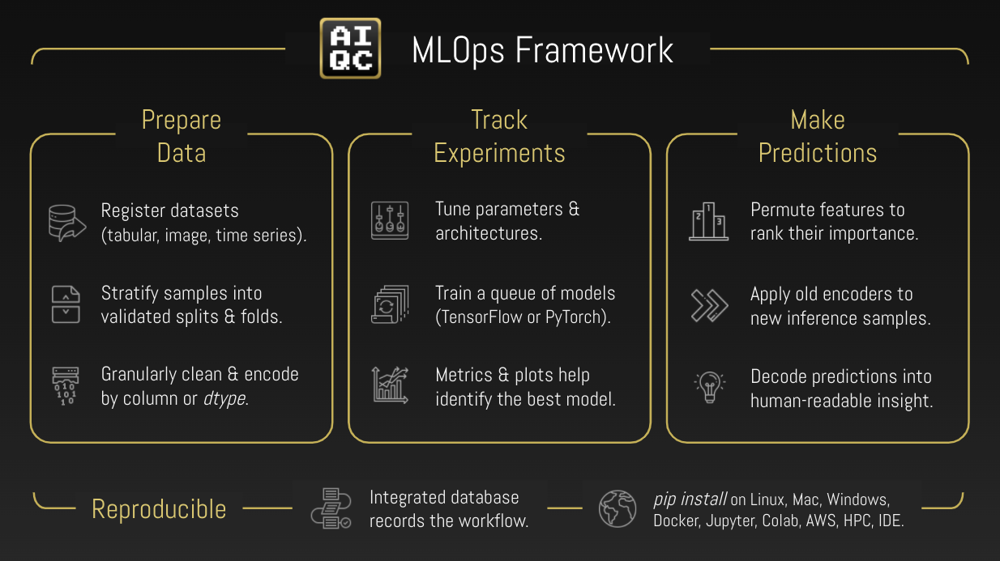

.. toctree::
  :maxdepth: 2
  :caption: Getting Started
  :hidden:

  tutorials
  notebooks/example_datasets
  notebooks/installation

.. toctree::
  :maxdepth: 2
  :caption: Documentation
  :hidden:

  notebooks/visualization
  notebooks/api_high_level
  notebooks/api_low_level
  notebooks/inference

.. toctree::
  :maxdepth: 2
  :caption: About
  :hidden:

  mission
  explainer
  community
  compare

..
  Without this comment, `make html` throws warning about page beginning improperly.

.. 
   nick wrote this when we were talking about how to get his custom google form
   to show in the documentation to prevent seeing docs without providing your email.
   he said you could track whether or not they provided it with a cookie.
   https://github.com/js-cookie/js-cookie

   raw:: html

   

   

.. raw:: html
  
   
  

    <b style="font-size: 18px;"><i>What discovery will you make today?</i></b>
     
     
    <i class="intro" style="color:gray; font-size: 14.5px !important;">AIQC accelerates research with a simple framework for best practice MLops.</i>
            
  

.. raw:: html
  
    
  

    

      

        <a href="https://wiki.python.org/psf/ScientificWG/Charter_v3" target="_blank">
          <image class="flex-image" src='https://raw.githubusercontent.com/aiqc/AIQC/main/docs/images/psf_logo.png'">
        </a>
      

      

        <a href="https://wiki.python.org/psf/ScientificWG/Charter_v3" target="_blank">
          ↳ Sponsored by
        </a>
      

    

    

       

        <a href="https://aiqc.medium.com/" target="_blank">
          <image class="flex-image" src='https://raw.githubusercontent.com/aiqc/AIQC/main/docs/images/tds_logo_bw.png' />
        </a>
      

      

        <a href="https://aiqc.medium.com/" target="_blank">
          ↳ Blogged by
        </a>
      

    

    

      

        <a href="https://pydata.org/global2021/schedule/presentation/33/aiqc-deep-learning-experiment-tracking-with-multi-dimensional-prepost-processing/" target="_blank">
         <image class="flex-image" src='https://raw.githubusercontent.com/aiqc/AIQC/main/docs/images/pydata_logo.png' />
        </a>
      

      

        <a href="https://pydata.org/global2021/schedule/presentation/33/aiqc-deep-learning-experiment-tracking-with-multi-dimensional-prepost-processing/" target="_blank">
          ↳ Presented at
        </a>
      

    

  

    

----

.. raw:: html
  
    
  

    <b>→ Write 98% less code with rapid, rigorous, & reproducible <a href='tutorials.html'>workflows</a>.</b>
  

    

.. raw:: html
  
  <table class="compatibility" valign="center">
  <tr>
    <td id="top-left"></td>
    <td class="tbl-head  top-left">Tabular <small>(2D: array, df, file, single site time series)</small></td>
    <td class="tbl-head">Sequence <small>(3D: files, channels, multi site time series)</small></td>
    <td class="tbl-head  top-right">Image <small>(4D: multi image,  grayscale video)</small></td>
  </tr>
  <tr>
    <td class="tbl-head top-left">Classification <small>(binary, multi)</small></td>
    <td class="done">
      Keras (<a href='notebooks/keras_binary_classification.html'>binary</a>,
      <a href='notebooks/keras_multi-label_classification.html'>multi</a>)
       ✓ 
      PyTorch (<a href='notebooks/pytorch_binary_classification.html'>binary</a>,
      <a href='notebooks/pytorch_multi-label_classification.html'>multi</a>)
    </td>
    <td class="done">
      Keras (<a href='notebooks/sequence_classification.html'>binary</a>,
      multi</a>)
       ✓ 
      PyTorch (binary, multi)
    </td>
    <td class="done">
      Keras (<a href='notebooks/image_classification.html'>binary</a>,
      multi</a>)
       ✓ 
      PyTorch (binary, multi) 
    </td>
  </tr>
  
  <tr>
    <td class="tbl-head">Quantification <small>(regression)</small></td>
    <td class="done">
      <a href='notebooks/keras_regression.html'>Keras</a>
       ✓ 
      <a href='notebooks/pytorch_regression.html'>PyTorch</a>
    </td>
    <td class="done">Keras ✓ PyTorch</td>
    <td class="done">Keras ✓ PyTorch</td>
  </tr>

  <tr>
    <td class="tbl-head bottom-left">Forecasting <small>(multivariate walk forward)</small></td>
    <td class="done">
      <a href='notebooks/keras_tabular_forecasting.html'>Keras</a>
       ✓ 
      PyTorch
    </td>
    <td class="done">Keras ✓ PyTorch</td>
    <td class="done bottom-right">
      <a href='notebooks/keras_image_forecasting.html'>Keras</a> 
      ✓ 
      PyTorch</td>
  </tr>
  
  <!--
  <tr>
    <td class="tbl-head tbl-head-Generation">Forecast </td>
    <td class="done">
      <a href='notebooks/keras_tabular_forecasting.html'>Keras</a>
       ✓ 
      PyTorch
    </td>
    <td>Coming soon.</td>
    <td class="coming-soon">Coming soon.</td>
  </tr>
  -->
  </table>

    
  

    AIQC provides structured <b>protocols</b> that automate <i>data wrangling</i> processes that vary based on:  <i>analysis type</i> (e.g. categorize, quantify, generate), <i>data type</i> (e.g. spreadsheet, sequence, image),  and <i>data dimensionality</i> (e.g. timepoints per sample). 
  

  

    The <i>DIY</i> approach of patching together <i>custom code and toolsets</i> for each analysis is not maintainable because it places a <i>skillset burden</i> of both data science and software engineering upon a research team.
  

   

----

.. raw:: html
  
    
  

    <b>→ How do you quality control (QC) your machine learning lifecycle?</b>
  

    

  <table class="compatibility qc" valign="center">
    <colgroup>
       <col span="1" style="width: 32%;">
       <col span="1" style="width: 14%;">
       <col span="1" style="width: 14%;">
       <col span="1" style="width: 14%;">
       <col span="1" style="width: 26%;">
    </colgroup>

    <tr>
      <td id="top-left"></td>
      <td class="tbl-head  top-left">Train</td>
      <td class="tbl-head">Validation</td>
      <td class="tbl-head">Test</td>
      <td class="tbl-head  top-right">Inference</td>
    </tr>
    <tr>
      <td class="top-left alt-gray">Prevent <b class="purple"><i>evaluation bias</i></b> with 3-way+ stratification.</td>
      <td class="alt-gray">Split or Folds</td>
      <td class="alt-gray">Split or Folds</td>
      <td class="alt-gray">Holdout split</td>
      <td class="best-practice"><b class="purple"><i>Verify the schema</i></b> of incoming samples.</td>
    </tr>
    
    <tr>
      <td class="alt-darkerGray">Prevent <b class="purple"><i>data leakage</i></b> with  fit-on-train preprocessing.</td>
      <td class="alt-darkerGray"><i>fit()</i>’s & <i>transform()</i>’s</td>
      <td class="alt-darkerGray">Apply <i>transform()</i>’s</td>
      <td class="alt-darkerGray">Apply <i>transform()</i>’s</td>
      <td class="best-practice alt-darkerGray">Help prevent <b class="purple"><i>data drift</i></b>  by using original preprocessors.</td>
    </tr>

    <tr>
      <td class="alt-gray">Detect <b class="purple"><i>overfitting</i></b> by evaluating each split/ fold of every model.</td>
      <td class="alt-gray">Metrics & charts</td>
      <td class="alt-gray">Metrics & charts</td>
      <td class="alt-gray">Metrics & charts</td>
      <td class="alt-gray">Detect <b class="purple"><i>model rot</i></b> by reevaluating with supervised datasets.</td>
    </tr>

    <tr>
      <td class="bottom-left alt-darkerGray">Ensure <b class="purple"><i>reproducibility</i></b> by recording the entire workflow.</td>
      <td class="bottom-right alt-darkerGray" colspan="4">Easily query experiment metadata e.g. <i>`aiqc.Algorithm.get_by_id(n).fn_build`</i></td>
    </tr>
  </table>
  
   
  

    <a href="compare.html" target="_blank">
      <i>↳ How does AIQC compare to other experiment trackers?</i>
    </a>
  

    

----

.. raw:: html

    
  

    <b>→ &nbsp; Goodbye, boilerplate scripts <i>(X_train, y_test)</i>. &nbsp; Hello, object-oriented machine learning.</b>
        
    
    

      
Low-Level API

       
      

        
Dataset()

Feature()

Label()

Splitset()

Encoder()

        
Algorithm()

Hyperparamset()

Job()

Queue()

Prediction()

        <i>etc.</i>
      

    

     
    

      
High-Level API

       
      

        
Pipeline()

Experiment()

      

    

  

    

----

..
  Overview <h1> is intentionally hidden by CSS.

########
Overview
########

.. raw:: html
  
    
  

    <b>→ Automated visualizations for evaluating each split & fold of every model.</b>
  

    

.. image:: images/visualizations.gif
  :width: 100%
  :alt: visualizations.gif

.. raw:: html

     
  

    
<i>Let's get started!</i>

     
    <a href="tutorials.html">
      
<b>→</b> Use Cases & Tutorials

    </a>
  

    

.. raw:: html

  