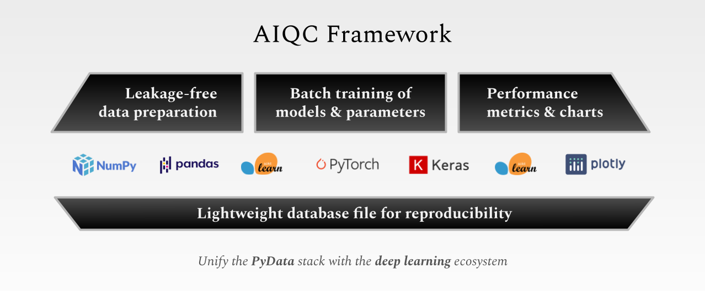
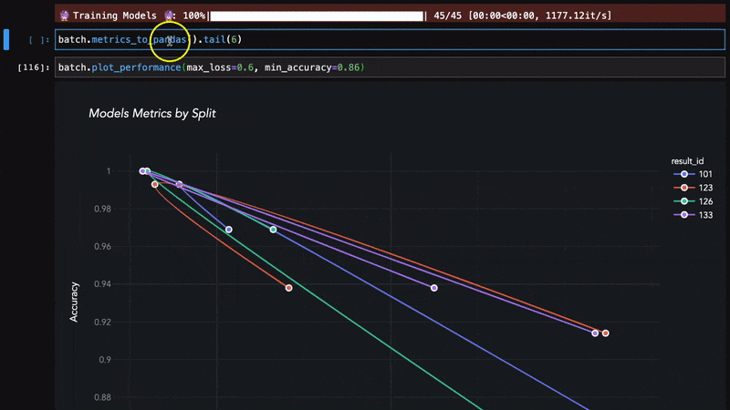

.. toctree::
  :maxdepth: 2
  :caption: About
  :hidden:

  self
  mission
  links

.. toctree::
  :maxdepth: 2
  :caption: Start
  :hidden:

  notebooks/installation
  notebooks/example_datasets

.. toctree::
  :maxdepth: 2
  :caption: Tutorials
  :hidden:

  notebooks/keras_binary_classification
  notebooks/keras_multi-label_classification
  notebooks/keras_regression
  notebooks/pytorch

.. toctree::
  :maxdepth: 2
  :caption: Documentation
  :hidden:

  notebooks/api_high_level
  notebooks/api_low_level
  notebooks/visualization
  compatibility
  

.. image:: images/aiqc_logo_banner_narrow.png
  :width: 100%
  :align: center
  :alt: AIQC logo wide

|

########
Overview
########

..
  Without this comment, `make html` throws warning about page beginning w horizontal line below.

----

* AIQC is an open source Python package that simplifies data preparation and parameter tuning for batches of deep learning models without an expensive cloud backend.

  * It *empowers researchers* by reducing the programming and data science know-how required to integrate machine learning into their research.

  * It makes machine learning less of a black box by *reproducibly recording experiments* in a file-based database that requires no configuration.

|

I. Rapidly prepare folded data for analysis without leakage.
============================================================

.. image:: images/pipeline_25sec_compress.gif
  :width: 100%
  :alt: pipeline.gif

* Make datasets from files (csv, parquet), structures (pandas, numpy), & images (pillow).

* Designate columns by name as either Features or Labels.

* Easily split, fold, & stratify samples (`size_validation=0.12`, `fold_count=5`).

* Apply encoders by dtype (`float64`) without leaking test/ validation data.

|

II. Train many variations of an algorithm in a single batch.
============================================================

.. image:: images/hyperparam_25sec_compress.gif
  :width: 100%
  :alt: hyperparameters.gif

* Queue a batch a many training jobs; one job per hyperparameter combination.

* Automatically passes param combinations into model functions as `**kwargs`.

* Tweak the model topology as a param (`params['extra_conv3D_layer']=True`).

* Repeat a job to to give it a chance to perform well (`repeat_count=3`).

|

III. Evaluate algorithm performance with metrics & charts.
==========================================================

* Automated performance metrics & visualization for every split/ fold.

* Define multi-metric success criteria for early stopping.

* Captures per-epoch history metrics for learning curves.

* Aggregate metrics for sets of cross-folded jobs.

|

IV. Effortlessly reproduce & prove experiments.
===============================================

.. code-block:: python

   # Everything is saved. No more writing down parameters or screenshotting charts!
   batch.jobs[0].hyperparamcombo.hyperparameters
   {
       'include_nth_layer': True,
       'initialization': 'he_normal',
       'batch_size': 8,
       'dense_neurons': 64
   }

   # Recorded end-to-end:
   batch.jobs[0].results[0].get_model() # trained model
   batch.algorithm.function_model_build # model definition
   batch.jobs[0].results[0].predictions['fold_validation'] # predictions
   batch.jobs[0].fold.samples['fold_validation']['features'] # sample indeces by split

* Automatically records experiments in a local sqlite database file.

* No infrastructure hassle; `aiqc.setup()` creates the database for you.

|

V. Easy to install. Tutorials to guide you.
===========================================

.. code-block:: python

   # pip install --upgrade aiqc

   import aiqc
   from aiqc import datum # data for tutorials.
   
   aiqc.setup() # create & connect to the database.

* Example datasets built into package. Example image datasets in github repo.

* Use any IDE (jupyter, rstudio, vscode, pycharm, spyder) & OS (win, mac, lin).

* Easy to learn with 2 step tutorials: make a `Pipeline` to feed an `Experiment`.

