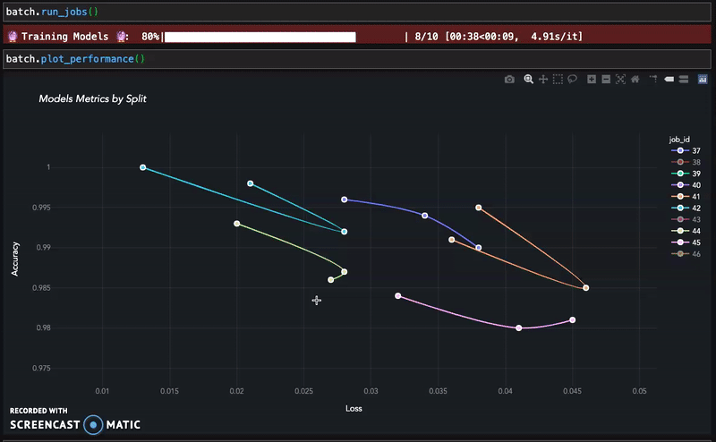

.. toctree::
   :maxdepth: 2
   :caption: About
   :hidden:

   self
   mission
   features
   links

.. toctree::
   :maxdepth: 2
   :caption: Getting Started
   :hidden:

   notebooks/installation
   notebooks/example_datasets

.. toctree::
   :maxdepth: 2
   :caption: API Documentation
   :hidden:

   notebooks/api_high_level
   notebooks/api_low_level
   notebooks/visualization

.. image:: images/aiqc_logo_wide_black_docs.png
   :width: 385
   :align: center
   :alt: AIQC logo wide

----

##########
Highlights
##########

* Turnkey hyperparameter tuning for batches of models.
* Visually compare performance metrics.
* Record experiments in a SQLite file.
* API/ ORM for sample and model pipelines.
* Validation splits & cross-folds are first-level citizens.
* Track which samples make up which split/ fold.
* Encode splits/ folds on the fly by dtype or column.
* Designed for Jupyter, but IDE/ OS agnostic.
* No infrastructure to configure, just pip install.

====
TLDR
====

Reference the :doc:`notebooks/installation` section for more instructions.

.. code-block:: bash
   
   pip install aiqc
   import aiqc

=================
Value Proposition
=================
* *AIQC* is an open source, automated machine learning (AutoML) tool that reduces the amount of code needed to perform best practice machine learning by 95%; more science with less code.

  * It is a Python package that records experiments in a lightweight, file-based database that requires no configuration. By tracking the input (samples and settings) as well as output (models and metrics) of each experiment, it makes machine learning reproducible; less of a black box.

  * Users can either (a) queue many experiments on their desktop/ server, or (b), in the near future, delegate them to run in the *AIQC Cloud* if they outgrow their local resources. From there, model performance metrics can be visually compared in interactive charts. It is designed for use within Jupyter notebooks, but runs in any Python shell.
