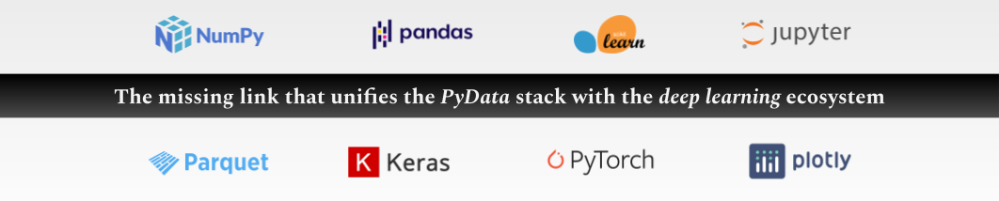

.. toctree::
  :maxdepth: 2
  :caption: About
  :hidden:

  self
  mission
  community
  links

.. toctree::
  :maxdepth: 2
  :caption: Start
  :hidden:

  notebooks/installation
  notebooks/example_datasets

.. toctree::
  :maxdepth: 2
  :caption: Tutorials
  :hidden:

  notebooks/keras_binary_classification
  notebooks/keras_multi-label_classification
  notebooks/keras_regression
  notebooks/pytorch

.. toctree::
  :maxdepth: 2
  :caption: Documentation
  :hidden:

  notebooks/api_high_level
  notebooks/api_low_level
  notebooks/visualization
  compatibility

.. image:: images/aiqc_logo_banner_narrow.png
  :width: 100%
  :align: center
  :alt: functionality banner

|

########
Overview
########

..
  Without this comment, `make html` throws warning about page beginning w horizontal line below.

----

.. 
   nick wrote this when we were talking about how to get his custom google form
   to show in the documentation to prevent seeing docs without providing your email.
   he said you could track whether or not they provided it with a cookie.
   https://github.com/js-cookie/js-cookie

   raw:: html

   

   

* AIQC exists to bring rapid & reproducible deep learning to open science. 

  * `Mission - empower open science: <https://aiqc.readthedocs.io/en/latest/mission.html>`__ [1] Reduce the programming & data science know-how required to adopt deep learning. [2] Automatically record experiment workflows. [3] Provide a free alternative to expensive cloud SaaS & walled gardens. [4] Accelerate Earth-healing discoveries.

  * `Tech - open source Python package: <https://aiqc.readthedocs.io/en/latest/notebooks/installation.html>`__ [1] Provide best-practice guardrails in the form of an object-oriented API (e.g. Label, Hyperparamset, Job). [2] Simplify preprocessing and batch model tuning/ scoring. [3] Prevent data leakage and evaluation bias. [4] Persist experiments in a SQLite database file.

.. image:: images/framework_w_sci.png
  :width: 100%
  :align: center
  :alt: framework

|

|

I. Rapidly prepare folded data for analysis without leakage.
============================================================

.. image:: images/pipeline_25sec_compress.gif
  :width: 100%
  :alt: pipeline.gif

* Make datasets from files (csv, parquet), structures (pandas, numpy), & images (pillow).

* Designate columns by name as either Features or Labels.

* Easily split, fold, & stratify samples (`size_validation=0.12`, `fold_count=5`).

* Apply encoders by dtype (`float64`) without leaking test/ validation data.

|

II. Train many variations of an algorithm in a single batch.
============================================================

.. image:: images/hyperparam_25sec_compress.gif
  :width: 100%
  :alt: hyperparameters.gif

* Queue a batch a many training jobs; one job per hyperparameter combination.

* Automatically passes param combinations into model functions as `**kwargs`.

* Tweak the model topology as a param (`params['extra_conv3D_layer']=True`).

* Repeat a job to to give it a chance to perform well (`repeat_count=3`).

|

III. Evaluate algorithm performance with metrics & charts.
==========================================================

.. image:: images/plots_25sec_compress.gif
   :width: 100%
   :alt: plots.gif

* Automated performance metrics & visualization for every split/ fold.

* Define multi-metric success criteria for early stopping.

* Captures per-epoch history metrics for learning curves.

* Aggregate metrics for sets of cross-folded jobs.

|

IV. Effortlessly track, reproduce, & prove experiments.
=======================================================

.. code-block:: python

   # Everything is saved. No more writing down parameters or screenshotting charts!
   batch.jobs[0].hyperparamcombo.hyperparameters
   {
       'include_nth_layer': True,
       'initialization': 'he_normal',
       'batch_size': 8,
       'dense_neurons': 64
   }

   # Recorded end-to-end:
   batch.jobs[0].results[0].get_model() # trained model
   batch.algorithm.function_model_build # model definition
   batch.jobs[0].results[0].predictions['fold_validation'] # predictions
   batch.jobs[0].fold.samples['fold_validation']['features'] # sample indeces by split

* Automatically records experiments in a local SQLite database file.

* No infrastructure hassle; `aiqc.setup()` creates the database for you.

|

V. Easy to :ref:`install </notebooks/installation.ipynb>`. With :ref:`tutorials</notebooks/api_high_level.ipynb>` to guide you.
===============================================================================================================================

.. code-block:: python

   # pip install --upgrade aiqc

   import aiqc
   from aiqc import datum # data for tutorials.
   
   aiqc.setup() # create & connect to the database.

* Example datasets built into package. Example image datasets in github repo.

* Use any IDE (jupyter, rstudio, vscode, pycharm, spyder) & OS (win, mac, lin).

* Easy to learn with 2 step tutorials: make a `Pipeline` to feed an `Experiment`.

