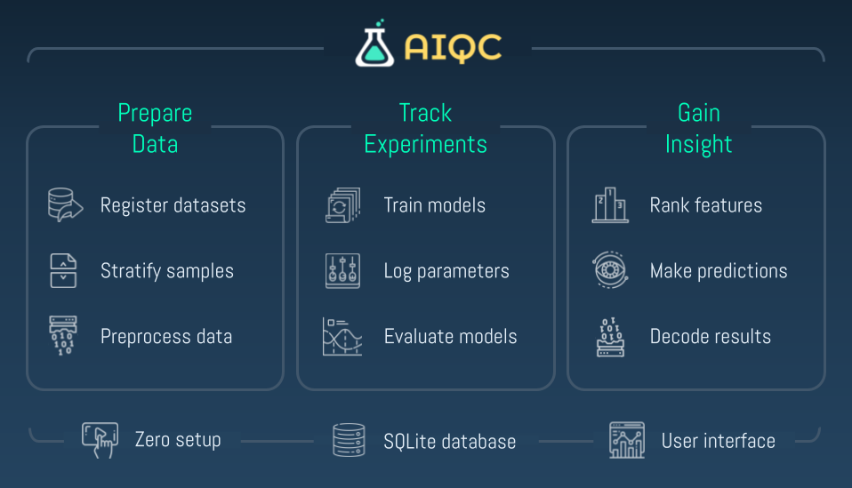

.. toctree::
  :maxdepth: 2
  :caption: Getting Started
  :hidden:

  pages/gallery
  notebooks/installation
  notebooks/dashboard

.. toctree::
  :maxdepth: 2
  :caption: Documentation
  :hidden:

  notebooks/api_high_level
  notebooks/api_low_level
  notebooks/datasets
  notebooks/evaluation

.. toctree::
  :maxdepth: 2
  :caption: About
  :hidden:

  pages/explainer
  pages/community
  pages/compare
  pages/mission

..
  Without this comment, `make html` throws warning about page beginning improperly.

.. raw:: html
  
  

      
    

      

        Accelerate Research with Deep Learning
      

    

  

  

    <svg viewBox="0 0 500 150" preserveAspectRatio="none" style="height: 100%; width: 100%;">
      <path d="M0.00,92.27 C216.83,192.92 304.30,8.39 500.00,109.03 L500.00,0.00 L0.00,0.00 Z" style="stroke: none; fill:#122536;"></path>
    </svg>
  

    
  

    

      An easy-to-use API & UI for the end-to-end AI lifecycle
    
 
      
    <a class="github-button" href="https://github.com/aiqc/aiqc" data-color-scheme="no-preference: light; light: light; dark: light;" data-size="large" data-show-count="false" aria-label="Star aiqc/aiqc on GitHub">
      Star on GitHub
    </a>
     
  

    

.. raw:: html
  
      
  

    

      

        
      

      

        ↳ Sponsored by
        <!--
        <a href="https://wiki.python.org/psf/ScientificWG/Charter_v3" target="_blank">
          ↳ Sponsored by
        </a>
        -->
      

    

    

       

        
      

      

        <a href="https://www.youtube.com/watch?v=suV5i-Y9tws" target="_blank">
          ↳ Presented at
        </a>
      

    

    

      

        
      

      

        ↳ Presented at
        <!--
        <a href="https://pydata.org/global2021/schedule/presentation/33/aiqc-deep-learning-experiment-tracking-with-multi-dimensional-prepost-processing/" target="_blank">
          ↳ Presented at
        </a>
        -->
      

    

  

  
      
  
  <!-- 3 BRs or a 60% margin makes the shapes below get misaligned -->
  <!--
  

    
     
    <a class="linx" href="pages/compare.html" target="_blank">
      ↳ How does AIQC compare to other experiment trackers?
    </a>

         

    <iframe width="93%" height="350" src="https://www.youtube.com/embed/suV5i-Y9tws" title="YouTube video player" frameborder="0" allow="accelerometer; autoplay; clipboard-write; encrypted-media; gyroscope; picture-in-picture" allowfullscreen>
    </iframe>
    

      (play video with Chrome or enable FireFox embedded content)
    

  

    
  -->

  

    <svg viewBox="0 0 500 150" preserveAspectRatio="none" style="height: 100%; width: 100%;">
      <path d="M0.00,92.27 C216.83,192.92 304.30,8.39 500.00,109.03 L500.00,0.00 L0.00,0.00 Z" style="stroke: none; fill:#122536;"></path>
    </svg>
  

  

      
    

      
Reduce data wrangling with a declarative API

         

      <!-- https://codepen.io/davehert/pen/MWrYjZy -->
      

        

        

        

        

        

        

        

        

        <!-- Control buttons -->
        
 > 

        
 < 

      

    

           
  

         
  

    
Write 90% less glue-code with <a class="linx-light" href='pages/gallery.html' style="text-decoration: underline;">declarative pipelines</a>

  

    

  <table class="compatibility" valign="center">
    <tr>
      <td id="empty-cell"></td>
      <td class="tbl-head  top-left">Tabular <small>(2D)</small></td>
      <td class="tbl-head">Sequence <small>(3D)</small></td>
      <td class="tbl-head  top-right">Image <small>(4D)</small></td>
    </tr>
    <tr>
      <td class="tbl-head top-left">Classification <small>(binary, multi)</small></td>
      <td class="done">
        <a href='notebooks/gallery/tensorflow/multi_tcga.html'>
          ✓
        </a>
      </td>
      <td class="done">
        <a href='notebooks/gallery/tensorflow/seq_class.html'>
          ✓
        </a>
      </td>
      <td class="done">
        <a href='notebooks/gallery/tensorflow/img_class.html'>
          ✓
        </a>
      </td>
    </tr>
    
    <tr>
      <td class="tbl-head">Quantification <small>(regression)</small></td>
      <td class="done">
        <a href='notebooks/gallery/tensorflow/reg.html'>
          ✓
        </a>
      </td>
      <td class="done">
        ✓
      </td>
      <td class="done">
        ✓
      </td>
    </tr>

    <tr>
      <td class="tbl-head bottom-left">Forecasting <small>(multivariate)</small></td>
      <td class="done">
        <a href='notebooks/gallery/tensorflow/tab_forecast.html'>
          ✓
        </a>
      </td>
      <td class="done">
        ✓
      </td>
      <td class="done bottom-right">
        <a href='notebooks/gallery/tensorflow/img_forecast.html'>
          ✓
        </a>
    </tr>
  </table>

    
  

    AIQC provides structured protocols that automate <i>data wrangling</i> processes that vary based on: <i>analysis type</i> (e.g. categorize, quantify, generate), <i>data type</i> (e.g. spreadsheet, sequence, image), and <i>data dimensionality</i> (e.g. timepoints per sample). 
  

  

    The <i>DIY</i> approach of patching together <i>custom code and toolsets</i> for each analysis is not maintainable because it places a <i>skillset burden</i> of both data science and software engineering upon a research team.
  

      

  

    

  

  
      
  

    
How do you quality control (QC) your machine learning lifecycle?

  

    

  <table class="compatibility qc" valign="center" style="width: 73% !important">
    <colgroup>
       <col span="1" style="width: 16.5%;">
       <col span="1" style="width: 21%;">
       <col span="1" style="width: 16.5%;">
       <col span="1" style="width: 46%;">
    </colgroup>

    <tr>
      <td class="tbl-head  top-left">Train</td>
      <td class="tbl-head">Validation</td>
      <td class="tbl-head">Test</td>
      <td class="tbl-head  top-right">Inference</td>
    </tr>
    <tr>
      <td class="alt-gray" colspan="3">Prevent evaluation bias with  3-way+ stratification.</td>
      <td class="alt-gray">Validate the structure  of new samples.</td>
    </tr>
    
    <tr>
      <td class="alt-darkerGray" colspan="3">Prevent data leakage by only using preprocessing information derived from the training split/fold.</td>
      <td class="best-practice alt-darkerGray">Prevent data drift by  using original preprocessors.</td>
    </tr>

    <tr>
      <td class="alt-gray" colspan="3">Prevent overfitting by evaluating each  split/ fold of every model</td>
      <td class="alt-gray">Detect model rot by reevaluating with supervised datasets.</td>
    </tr>

    <tr>
      <td class="bottom-left alt-darkerGray bottom-right" colspan="4">Ensure reproducibility by using a standardized framework  that records the entire workflow.</td>
    </tr>
  </table>
       

  

    

  

       
  

    
Automated visualizations for each split & fold of every model

      
    
  

        

..
  AIQC <h1> is intentionally hidden by CSS. This header is used for link previews.

####
AIQC
####

.. raw:: html

  

            
    

      
        
      
      
Conduct what-if analysis to simulate virtual outcomes

       
    

     
  

  

    <svg viewBox="0 0 500 150" preserveAspectRatio="none" style="height: 100%; width: 100%;">
      <path d="M0.00,92.27 C216.83,192.92 304.30,8.39 500.00,109.03 L500.00,0.00 L0.00,0.00 Z" style="stroke: none; fill:#122536;"></path>
    </svg>
  

       
  

    
  

     

      
  

    
<i>Let's get started!</i>

     
    <a href="pages/gallery.html">
      
<b>→</b> Use Cases & Tutorials

    </a>
  

     

  

    <svg viewBox="0 0 500 150" preserveAspectRatio="none" style="height: 100%; width: 100%;  transform:rotate(180deg);">
      <path d="M0.00,92.27 C216.83,192.92 304.30,8.39 500.00,109.03 L500.00,0.00 L0.00,0.00 Z" style="stroke: none; fill:#122536;"></path>
    </svg>
  

  

  

  

  

  
