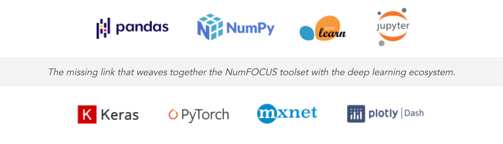

*******************
Mission & Community
*******************

Why Does AIQC Exist?
====================

To expedite Earth-saving scientific discoveries by:

1. Making deep learning more *accessible* to researchers by reducing the amount of *programming and data science know-how* required to perform machine learning.

2. In doing so, make artificial intelligence more scientifically rigorous, less of a *black box*, by implementing validation rules, a "Quality control (QC)" process, around reproducible workflows. We are bringing the *scientific method* to data science.

----

----

Problems Solved
===============

* **Empower Desktops/ HPCs + Disrupt Walled Gardens.**
  
  * Most research isn't performed in the cloud, it's performed on the machines of individuals. We empower non-cloud users: the academic/ institute HPCers, the remote server SSH'ers, and everyday desktop warriors - with the same quality ML tooling as present in public clouds (e.g. AWS SageMaker) and enterprise apps (e.g. DataRobot, c3). This toolset provides research teams a standardized method for ML-based evidence, rather than each researcher spending time cobbling together their own approach.

* **Reproducible Experiments.**
  
  * No more black boxes. No more screenshotting loss-accuracy graphs and hyperparameter combinations. A record of every: dataset, feature, label, sample, split, fold, parameter, model, training job, and result - is automatically persisted in a lightweight, file-based database that is automatically configured when you import the package. Submit your *aidb* database file alongside your publications/ papers and model zoo entries as a proof.

* **Queue Hypertuning Jobs.**
  
  * Design a batch of runs to test many hypotheses at once. Queue many hypertuning jobs locally, or delegate big jobs to the cloud to run in parallel by setting `cloud_queue = True`.

* **Queue Hypertuning Jobs.**
  
  * Design a batch of runs to test many hypotheses at once. Queue many hypertuning jobs locally, or delegate big jobs to the cloud to run in parallel by setting `cloud_queue = True`.

* **Visually Compare Performance Metrics.**
  
  * Compare models using pre-defined plots for assessing performance, including: quantitative metrics (e.g. accuracy, loss, variance, precision, recall, etc.), training histories, and confusion/ contingency matrices.

* **Code-Integrated & Agnostic.**

  * We don’t disrupt the natural workflow of data scientists by forcing them into the confines of a GUI app or specific IDE. Instead, we weave automated tracking into their existing scripts so that *AIQC* is compatible with any data science toolset.

----

Community
=========
Lend a hand in building the next generation of open source machine learning, bolster your resume, come learn about machine learning, or just talk shop!

Jump in the Slack channel on the :doc:`links` page to say hello. All are welcome.

Machine learning is a broad space with plenty of challenges to solve. Let us know if you want to get involved. We plan to host monthly dev jam sessions and data science lightning talks. It's more fun to hack in a group.

Don't know machine learning? It's surprisingly easy, we'll teach you.
