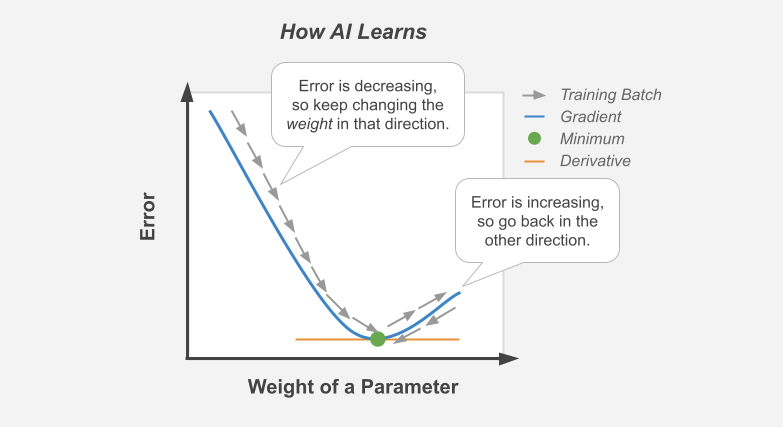

#################
Deep Learning 101
#################

*Boiling down a neural network to its fundamental concepts.*

----

|

.. raw:: html

   
  

    <h3>🔍 Types of Analysis</h3>
  

   
  

    If you are generally familiar with spreadsheets then you are already half way to understanding AI. For the purpose of this discussion, let's assume that each <i>row</i> in a spreadsheet represents a record, and each <i>column</i> provides information about that record. Bearing this in mind, there are two major types of AI:
  

.. list-table::
  :widths: 15, 85
  :align: center

  * - **Generative**
    - Given what we know about rows 1:1000 → generate row 1001.

  * - **Discriminative**
    - Given what we know about columns A:F → determine column G's values.

|

.. image:: ../_static/images/explainer/analysis_type.png
  :width: 75%
  :align: center
  :alt: gears
  :class: no-scaled-link

|
|
|

----

|

.. raw:: html
  
   
  

    <h3>🔬 Subtypes of Analysis</h3>
  

   
  

    In this tutorial, we will focus on <i>discriminative</i> analysis as it is highly practical and easier to understand. This subtype of analysis helps us answer two important kinds of questions:
  

.. list-table::
  :widths: 15, 12, 70
  :align: center
  
  * - **Categorize**
    - What is it?
    - e.g. benign vs malignant? which species? landmine vs rock? 

  * - **Quantify**
    - How much?
    - e.g. price? distance? weight? age? radioactivity?

|

.. image:: ../_static/images/explainer/categorize_quantify.png
  :width: 85%
  :align: center
  :alt: categorize_quantify
  :class: no-scaled-link

|

.. raw:: html
  
   
  

    Digging one layer deeper, there are two types of categorization:
  

.. list-table::
  :widths: 12, 30, 10
  :align: center
  
  * - **Binary**
    - Checking for the presence of a single condition
    - e.g. tumor

  * - **Multi-Label**
    - When there are many possible outcomes
    - e.g. species

|
|

----

|

.. raw:: html

   
  

    <h3>🌡️ Variables</h3>
  

.. raw:: html

   
  

    As an example, let's pretend we work at a zoo where we have a spreadsheet that contains information about the traits of different animals. We want to use <i>discriminative learning</i> in order to <i>categorize</i> the species of a given animal.
  

.. list-table::
  :widths: 15, 25, 60
  :align: center
  
  * - **Features**
    - Indepent Variable *(X)*
    - Informative columns like `num_legs`, `has_wings`, `has_shell`.

  * - **Label**
    - Dependent Variable *(y)*
    - The `species` column that we want to predict.

|

.. image:: ../_static/images/explainer/turtle_ruler.png
  :width: 45%
  :align: center
  :alt: turtle_ruler
  :class: no-scaled-link

|

.. raw:: html

  

    We learn about the <i>features</i> in order to predict the <i>label</i>.
  

|
|

----

|

.. raw:: html

   
  

    <h3>🍱 Stratification</h3>
  

   
  

    Our predictive algorithm will need samples to learn from as well as samples for <i>evaluating</i> its performance.
  

   
  

.. image:: ../_static/images/explainer/stratification.png
  :width: 85%
  :align: center
  :alt: turtle_ruler
  :class: no-scaled-link

.. raw:: html

    
  

    So we <i>split</i> our dataset into subsets for these purposes. 
    It's important that the distribution of each subset is <i>representatitive</i> of the broader population because we want our algorithm to be able to <i><a href="https://aiqc.medium.com/memorization-isnt-learning-it-s-overfitting-b3163fe6a8b4" target="_blank">generalize</a></i>.
  

.. list-table::
  :widths: 7, 5, 31
  :align: center
  
  * - **Train**
    - 67%
    - What the algorithm is trained on/ learns from.

  * - **Validation**
    - 21%
    - What the model is evaluated against during training.

  * - **Test**
    - 12%
    - Blind *holdout* for evaluating the model at the end of training.

|
|

----

|

.. raw:: html

   
  

    <h3>📞 Encoding & Decoding</h3>
  

   
  

    Before an algorithm can interact with the data, it needs to be <a href="https://scikit-learn.org/stable/modules/classes.html#module-sklearn.preprocessing" target="_blank">encoded</a> into numeric format. 
  

   

.. list-table::
  :widths: 15, 10, 80
  :align: center

  * - **Binarize**
    - Categorical
    - 1 means presence, 0 means absence.
  
  * - **OneHotEncode(OHE)**
    - Categorical
    - Expand 1 multi-category col into many binary cols.

  * - **Ordinal**
    - Categorical
    - [Bad form] Each category assigned an integer [0,1,2].

  * - **Scale**
    - Continuous
    - Shrink the range of values between -1:1 or 0:1.

.. raw:: html

  

    Normalization also <a href="https://towardsdatascience.com/data-leakage-5dfc2e0127d4" target="_blank">helps features start on equal footing and prevent gradient explosion</a>.
  

|

.. image:: ../_static/images/explainer/encode_decode.png
  :width: 50%
  :align: center
  :alt: encoding
  :class: no-scaled-link

|

.. raw:: html
 
  

    After the algorithm makes its prediction, that information needs to be decoded back into its orginal format
    so that it can be understood by practitioners.
  

|
|

----

|

.. raw:: html

   
  

    <h3>⚖️ Algorithm</h3>
  

   
  

    Now we need an equation (aka <i>algorithm</i> or <i>model</i>) that predicts our <i>label</i> when we show it a set of <i>features</i>. Here is our simplified example:
  

  
|

.. code-block:: python

  species = (num_legs * x) + (has_wings * y) + (has_shell * z)

.. raw:: html

  

    This mock equation is actually identical to a neural network with neither hidden layers nor bias neurons.
  

|

.. raw:: html

  

    The challenging part is that we need to figure out the right values (aka <i>weights</i>) for the <i>parameters</i> (x, y, z) so that our algorithm makes accurate predictions ⚖️ To do this by hand, we would simply use trial-and-error; change the value of <i>x</i>, and then see if that change either improved the model or made it worse.
  

|
|

----

|

.. raw:: html

   
  

    <h3>🎢 Gradient Descent</h3>
  

   
  

    Fortunately, computers can rapidly perform these repetetitive calculations on our behalf. This is where the magic of AI comes into play. It simply automates that trial-and-error.
  

|

.. raw:: html

   
  

    The figure above demonstrates what happens during a training <i>batch</i>: 
    (1) the algorithm looks at a few rows, 
    (2) makes predictions about those rows using its existing weights, 
    (3) checks how accurate those predictions are, 
    (4) adjusts its weights in an attempt to minimize future errors. 
    It's like finding the bottom of a valley by rolling a ball down it.
  

   

|

.. image:: ../_static/images/explainer/memory_foam.png
  :width: 35%
  :align: center
  :alt: memory_foam
  :class: no-scaled-link

|

.. raw:: html

  

    With repetition, the model molds to the features like a memory foam mattress.
  

  
|
|
  
----

|

.. raw:: html
  
   
  

    <h3>🏛️ Architectures</h3>
  

   
  

    There are different types of algorithms (aka neural network architectures)  for working with different types of data:
  

   

.. list-table::
  :widths: 25, 25, 50
  :align: center
  
  * - **Linear**
    - 🧮 Tabular
    - e.g. spreadsheets & tables.

  * - **Convolutional**
    - 📸 Positional
    - e.g. images, videos, & networks.

  * - **Recurrent**
    - ⏱️ Ordered
    - e.g. time, text, & DNA.

.. raw:: html

   
  

    They can be mixed and matched to handle almost any real-life scenario.
  

|
|

----

|

.. raw:: html
  
   
  

    <h3>🕸️ Networks</h3>
  

   
  

    Graph theory is a mathematical discipline that represents connected objects as networks comprised of:
  

.. list-table::
  :widths: 12, 12, 40, 21
  :align: center

  * - **Nodes**
    - neurons
    - participants in the network
    - 💡 e.g. lightbulbs

  * - **Edges**
    - weights
    - connect (aka link) the nodes together
    - 🔌 e.g. wires

|

|
|

----

|

.. raw:: html

   
  

    <h3>🗺️ Topology</h3>
  

   
  

    The structure of the neural network is referred to as the <i>topology</i>.
    The diagram below shows the topology of a linear architecture.
    Although it may seem overwhelming at first, the mechanisms of the individual components are actually quite simple.
    We'll start with the big picture and then deconstruct it to understand what each piece does. 
  

|

.. image:: ../_static/images/explainer/topology_rectangle.png
  :width: 95%
  :align: center
  :alt: oz
  :class: no-scaled-link

|

.. raw:: html

  

    Running with our network analogy - as data passes through each wire, it is multiplied by that wire's adjustable <i>weight</i> that we mentioned previously.
    In this way, the weights act like amplifiers that adjust the voltage passing through the network.
    Meanwhile, the neurons are like lightbulbs with degrees of brilliance based on the strength of the voltage they receive from all of their incoming wires.
    The <i>bias</i> neurons don't actually touch the data. They act like a y-intercept (think <i>b</i> in <i>y = mx + b</i>).
  

|

.. raw:: html

  

    If things still aren't making sense, try thinking of a neural network as a galtonboard (aka "bean machine"). The goal is to shape the <i>topology</i> 
    of the network so that it can successfully tease apart the patterns in the data to make the right predictions.
  

|

.. youtube:: S5WAswaJRjw
  :width: 66%
  :align: center

|
|

----

|

.. raw:: html

   
  

    <h3>🧅 Layers</h3>
  

   
  

    Within a neural network, there are different types of <i>layers</i>:
  

.. list-table::
  :widths: 20, 40
  :align: center
  
  * - **Input**
    - Receives the data. Mirrors the shape of incoming data.

  * - **Hidden**
    - Learns from patterns in data. # of layers & neurons with feature complexity.

  * - **Output**
    - Compares predictions to real label. Mirrors shape of labels (# of categories).
  
  * - **Regulatory**
    - [Not pictured here] *Dropout, BatchNorm, MaxPool* keep the network balanced.

|

.. image:: ../_static/images/explainer/layers.png
  :width: 30%
  :align: center
  :alt: layers
  :class: no-scaled-link

|

.. raw:: html

  

    Coming back to our zoo example, the number of input neurons in our input layer would be equal to the number of features, 
    and the number of output neurons in our output layer would be equal to the number of possible species.
  

   
  

   The number of hidden layers and the amount of hidden neurons in those layers will vary based on the complexity of the 
   problem we are trying to solve 🦏 Classifying rhinos vs mosquitoes based on their weight is such a simple task that it would 
   not require any hidden layers at all 🐆 However, delineating the subtle differences between types of big cats 
   (lynx, ocelot, tiger, cougar, panther) may require several layers in order to tease apart their differences.
   For example, the first hidden layer might check for spotted vs striped fur, while the second hidden layer determines the color of that marking.
  

|
|

----

|

.. raw:: html

   
  

    <h3>🧠 Biological Neurons</h3>
  

   
  

    How does a neuron in the brain process information? 
  

.. image:: ../_static/images/explainer/neuron.png
  :width: 60%
  :align: center
  :alt: neuron
  :class: no-scaled-link

|

.. raw:: html

  

    In the brain, networks of neurons work together to respond to an incoming stimulus. 
    They repeatedly pass information to downstream neurons in the form of neurotransmitters.
  

   
  

    However, neurons only forward information if certain conditions are met.
    As the neuron receives incoming signals, it builds up an electrically charged chemical concentration (aka <i>action potential</i>) inside its cell membrane. When this concentration exceeds a certain threshold, it fires a <i>spike</i>. 
  

|

.. image:: ../_static/images/explainer/squid.png
  :width: 100%
  :align: center
  :alt: squid
  :class: no-scaled-link

.. raw:: html

   
  

    The Hodgkin-Huxley duo discovered these phenomena by observing the rate at which neurons in giant squids fired spikes based on variations in current 🦑
    <i>Trappenburg, Fundamentals of Computational Neuroscience. 2nd edition, 2010</i>
  

|
|

----

|

.. raw:: html

   
  

    <h3>⚡ Artificial Neurons</h3>
  

   
  

    How does an artificial neuron process information?
  

  

   Similar to how a biological neuron aggregates an <i>action potential</i> based on input from preceding neurons - 
   an artificial neuron aggregates a <i>weighted sum</i> by adding up all of the values of its incoming weights.
  

|

.. image:: ../_static/images/explainer/activation.png
  :width: 60%
  :align: center
  :alt: activation
  :class: no-scaled-link

|

.. raw:: html

  

    How then is the spiking threshold for artificial neurons determined? Any way we program it! 
    The weighted sum can be ran through any <i>activation function</i> of our choosing.
  

    
  

    Different layers make use of different activation functions:
  

.. list-table::
  :widths: 12, 88
  :align: center
  
  * - **Input**
    - In a linear network, the receiving layer does not have an activation function.

  * - **Hidden**
    - The de facto activation function is *ReLU*. Rarely, *Tanh*.

  * - **Output**
    - *Sigmoid* for binary classify. *Softmax* for multi-label classify. None for regression.

|
|

----

|

.. raw:: html

   
  

    <h3>📈 Performance Metrics</h3>
  

  
   
  

    How does the algorithm know if its predictions are accurate? As mentioned in the sections above,
    it calculates the difference between its predicted label and the actual label. There are different
    strategies for calculating this <b><a href="https://keras.io/api/losses/" target="_blank">loss</a></b>:
  

.. list-table::
  :widths: 35, 25
  :align: center
  
  * - **BinaryCrossentropy**
    - Binary classification.

  * - **CategoricalCrossentropy**
    - Multi-label classification.

  * - **MeanSquaredError or MeanAbsoluteError.**
    - Used for regression.

|

.. raw:: html

  

   Although neural networks are great at minimizing loss, this metric is hard for humans to understand.
   The following two <b><a href="https://scikit-learn.org/stable/modules/classes.html#sklearn-metrics-metrics">metrics</a></b>
   are easy to understand because they both max out at 1.0 aka 100%:
  

.. list-table::
  :widths: 12, 15 
  :align: center
  
  * - **Accuracy**
    - Classification.

  * - **R²**
    - Regression.

|

.. raw:: html

  

    A <i>learning curve</i> keeps track of these metrics over the course of model training:
  

.. image:: ../_static/images/explainer/classify_learn.png
  :width: 90%
  :align: center
  :alt: learning_curve
  :class: no-scaled-link

|

.. raw:: html

  

    Have a look at the other <a href='../notebooks/visualization.html' target="_blank">visualizations & metrics</a>
     provided by AIQC.
  

|
|

----

|

.. raw:: html

   
  

    <h3>🎛️ Tuning</h3>
  

   
  

    A data scientist oversees the training of an neural network much like a chef prepares a meal. The heat is what actually cooks the food, but there are still a few things that the chef controls:
  

.. list-table::
  :widths: 18, 80
  :align: center

  * - **Duration**
    - Food isn't fully cooked? Train for more *epochs* or decrease the size of each *batch*.
  
  * - **Parameters**
    - Burning? Turn down *learning rate*. Tastes bad? Try *initialization*/ *activation* spices.

  * - **Topology**
    - If the food doesn't fit in the pan, switch to a larger pan with deeper/ taller *layers*.

  * - **Regulation**
    - Overfitting on the same old recipes? Add more *Dropout* to mix things up.

|

.. image:: ../_static/images/explainer/cooking.png
  :width: 55%
  :align: center
  :alt: cooking
  :class: no-scaled-link

|

.. raw:: html
  
   
  

    At first, the number of <i>tuning</i> options seems overwhelming, but you quickly realize that you only need to learn a handful of common dinner <a href='gallery.html'>recipes</a> in order to get by.
  

|
|

----

|

.. raw:: html

   
  

    <h3>🍻 Let's Get Started</h3>
  

   
  

    It's really that simple. The rest is just figuring out how to feed your data into and out of the algorithms, 
    which is where <a href='../index.html' target="_blank">AIQC</a> comes into play.
  

   

.. image:: https://imgs.xkcd.com/comics/machine_learning.png
  :width: 40%
  :align: center
  :alt: oz
  :class: no-scaled-link

.. raw:: html

   
  

    <small style="color:gray">
      <i>The classic <a href="https://xkcd.com/1838/" target="_blank">xkcd</a> comic.</i>
    </small>

        
    <a href="gallery.html">
      
<b>→</b> Use Cases & Tutorials

    </a>
  

  

